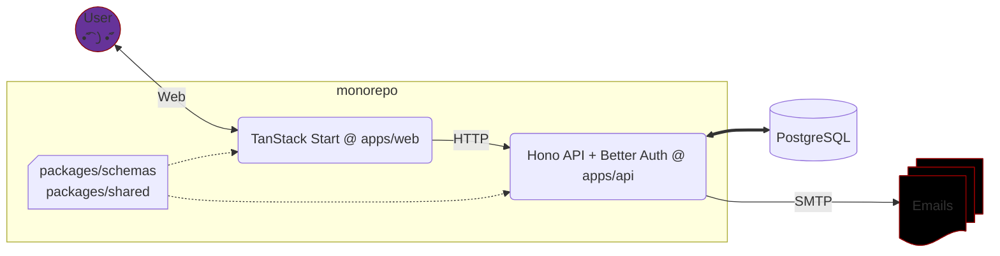

# Admin Starter


A TypeScript monorepo implementing pieces of **Better Auth** in a **Hono** [API](./apps/api/), with a **TanStack Start** [web app](./apps/web/) consuming it to demonstrate how they work together. 🎓 It’s a starter template with no business logic, so you could even grab the files and use them to kick-start your own project.

## Architecture



## Features

| User                                                                                      | Admin                        | Misc.                                             |
| ----------------------------------------------------------------------------------------- | ---------------------------- | ------------------------------------------------- |
| 🔹 Registration<br>🔹 Email verification <br>🔹 Cookie based Login<br>🔹 Update user data<br> | 🔹 List users<br><br><br><br> | 🔹 Docker Compose with DB and SMTP<br><br><br><br> |

## Demo

A [**Disco**](https://disco.cloud/) deployment is running on a tiny **Hetzner** instance at [**<big>https://kind-catmint-56983.ondis.co/**</big>](https://kind-catmint-56983.ondis.co/).

> It’s an ephemeral database. You can register, or use [test credentials](https://subztep.github.io/admin-starter/demo.html) to sign in.

## Quick Start

```sh
docker compose up -d
```

Docker Compose mounts the **PostgreSQL** data in the `./data` folder. Open [http://localhost:3000](http://localhost:3000) to access the UI.

## Documentation

A wise man once told me the source code is the best documentation. Share it with your favourite _AI agent_ and ask for the details. :trollface: That [**Jekyll** page](https://subztep.github.io/admin-starter/) is anything but _RTFM_.

## Stack

**Runtime / Language**  
Bun, TypeScript, Biome

**Frontend**  
React, TanStack Start, TanStack Form, TanStack Table, Tailwind, Vite, Lucide

**Backend / API**  
Hono, Better Auth, PostgreSQL

**Dev / Infrastructure**  
Docker Compose, Bun, GitHub Actions

**Validation / Schema**  
Zod

---
