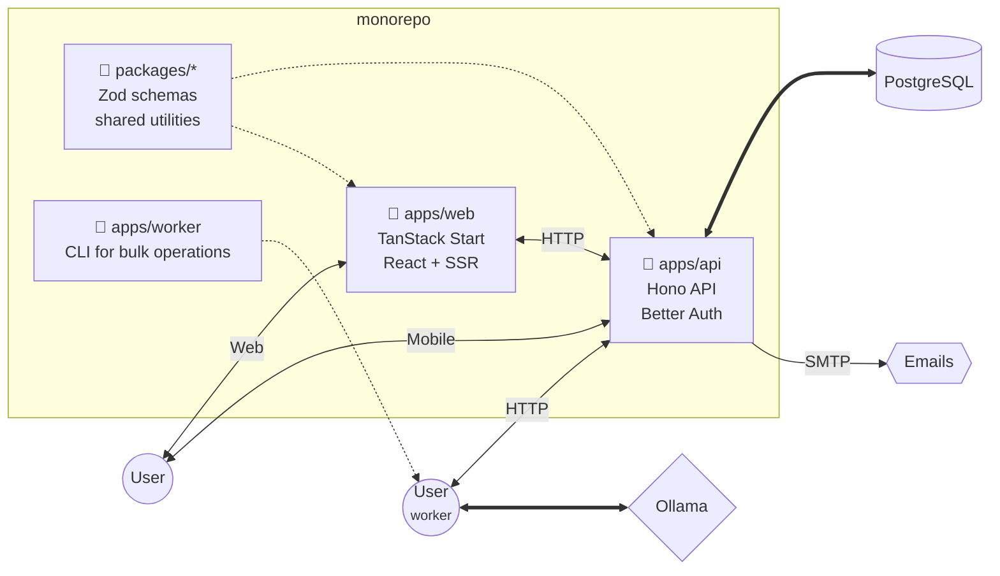

# Admin Starter


A TypeScript monorepo implementing pieces of **Better Auth** in a **Hono** [API](./apps/api/), with a **TanStack Start** [web app](./apps/web/) consuming it to demonstrate how they work together. 🎓 It’s a starter template with no business logic, so you could even grab the files and use them to kick-start your own project.

> [!NOTE]
> This isn’t even the final form. Its exact purpose are still evolving.

## Architecture



## Features

| User                                                                                                        | Admin                                         | Docker Compose                               |
| ----------------------------------------------------------------------------------------------------------- | --------------------------------------------- | -------------------------------------------- |
| 🔹 Register and verify your email <br>🔹 Update your profile<br>🔹 Log in with cookies<br>or bearer tokens<br> | 🔹 View users<br>🔹 Revoke sessions<br><br><br> | ▪️ `db`<br>▪️ `mail`<br>▪️ `api`<br>▪️ `web`<br> |

## Demo

**[<big>Click Here</big>](https://kind-catmint-56983.ondis.co/) for the demo!**

> It’s an ephemeral database. 🛡️\
> Register, or use a [test credential](https://subztep.github.io/admin-starter/demo/) to sign in.

## Quick Start

Working defaults in the [compose config](compose.yaml) and in `.env` files.

Just run:

```sh
docker compose up -d
```

Docker Compose mounts the **PostgreSQL** data in the `./pgdata` folder.\
Open [http://localhost:3000](http://localhost:3000) to access the UI.

More details on the [dev page](https://subztep.github.io/admin-starter/dev/).

## Environment Variables

There are .env files at `/apps/*/`. Just clone and run! Split Configuration between shared defaults and local overrides.

1. `.env` (Committed) -> Loads defaults
2. `.env.local` (Ignored) -> Loads your secrets/overrides
3. `.env.development` (Committed) -> Loads dev-specific defaults
4. `.env.development.local` (Ignored) -> Loads dev-specific secrets


## Documentation

_A wise man once told me the source code is the best documentation._ Share it with your favourite _AI agent_ and ask for the details. :trollface: [That **Jekyll** page](https://subztep.github.io/admin-starter/) is anything but _RTFM_.

## Stack

| Package                                               |  API  |  Web  | Worker | Description                                                          |
| ----------------------------------------------------- | :---: | :---: | :----: | -------------------------------------------------------------------- |
| [Better Auth](https://better-auth.com/)               |   ✓   |   ✓   |        | Authentication framework on [PostgreSQL](https://node-postgres.com/) |
| [Biome](https://biomejs.dev/)                         |   ✓   |   ✓   |   ✓    | Code format and linter                                               |
| [Bun](https://bun.sh/)                                |   ✓   |   ✓   |   ✓    | TypeScript runtime                                                   |
| [Clack](https://bomb.sh/docs/clack/packages/prompts/) |       |       |   ✓    | CLI library                                                          |
| [Hono](https://hono.dev/)                             |   ✓   |       |        | API framework                                                        |
| [Lucide](https://lucide.dev/)                         |       |   ✓   |        | Icons                                                                |
| [Nodemailer](https://nodemailer.com/)                 |   ✓   |       |        | Send emails                                                          |
| [Pino](https://getpino.io/)                           |   ✓   |       |        | Logger                                                               |
| [React](https://react.dev/)                           |   ✓   |   ✓   |        | Library for user intrfaces (emails in API)                           |
| [Tailwind CSS](https://tailwindcss.com/)              |       |   ✓   |        | Utility-first CSS framework                                          |
| [TanStack Form](https://tanstack.com/form/)           |       |   ✓   |        | Headless UI for type-safe forms                                      |
| [TanStack Query](https://tanstack.com/table/)         |       |   ✓   |        | Data fetching                                                        |
| [TanStack Start](https://tanstack.com/start/)         |       |   ✓   |        | Full-stack framework powered by [Vite](https://vite.dev/)            |
| [TanStack Table](https://tanstack.com/table/)         |       |   ✓   |        | Headless UI for tables & datagrids                                   |
| [Zod](https://zod.dev/)                               |   ✓   |   ✓   |        | Schema validation with static type inference                         |
