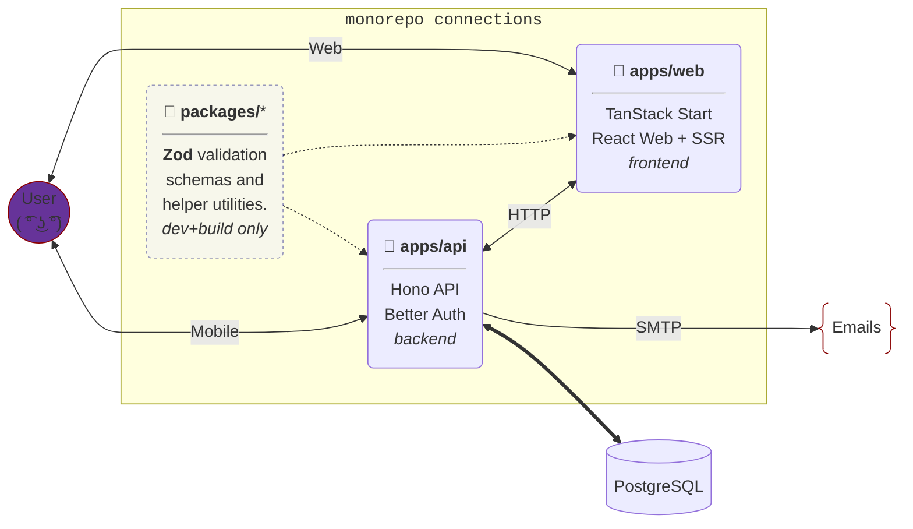

```mermaid
flowchart LR
  subgraph "<tt>monorepo connections</tt>"
  A("`**📁 apps/api**
  <hr>Hono API
  Better Auth
  _backend_</small>
  `")
  W("`**📁 apps/web**
  <hr/>TanStack Start
  React Web + SSR
  _frontend_`")
  S("`**📁 packages/***
  <hr>**Zod** validation
  schemas and
  helper utilities.
  _dev+build only_`")
  end
  U@{ shape: circ, label: "User\n( ͡° ͜ʖ ͡°)" }
  D@{ shape: cyl, label: "PostgreSQL" }
  E@{ shape: braces, label: "Emails" }
  S -.-> A
  U <-->|Web| W
  U <--->|Mobile| A
  S -.-> W
  A <==> D
  A <-->|HTTP| W
  A -- SMTP ---> E
  style S opacity:0.4,stroke:darkblue,stroke-width:1px,stroke-dasharray: 3 3
  style U fill:rebeccapurple,stroke:darkred,stroke-width:1px
  style E fill:black,stroke:darkred,stroke-style:dashed,stroke-width:1px
```
