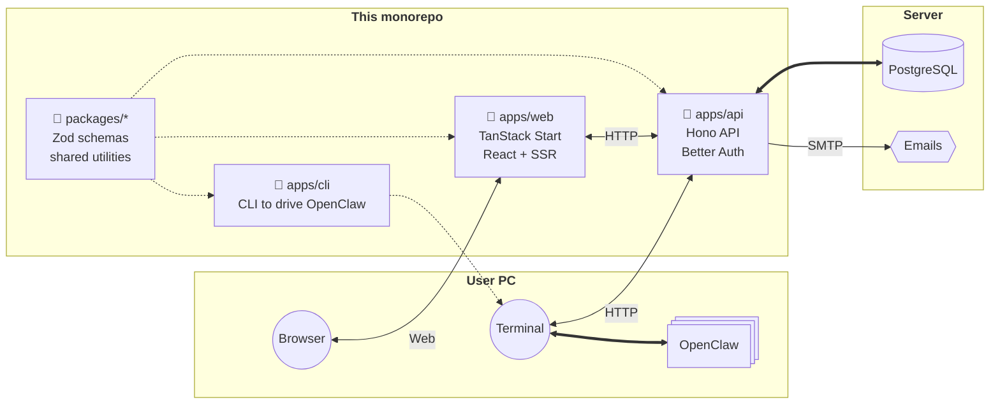

# Welcome to our documentation 🦋

_Work In Progress_ 🚧

## Architecture

## Start Your Project

1. [Config](./config/)
2. ???
3. Profit

## Legal

- [Privacy Policy](./privacy/)
- [Terms of Service](./terms/)
