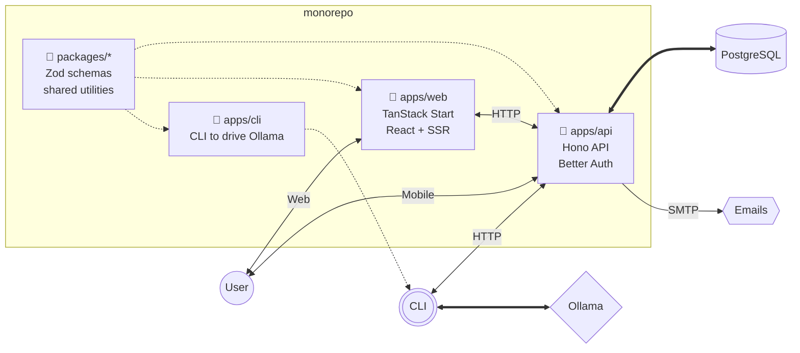

# Welcome to the documentation

> _Work In Progress_ 🚧

## Architecture

```mermaid
flowchart LR
  subgraph "monorepo"
    A["📁 apps/api<br/>Hono API<br/>Better Auth"]
    W["📁 apps/web<br/>TanStack Start<br/>React + SSR"]
    P["📁 packages/*<br/>Zod schemas<br/>shared utilities"]
    WW["📁 apps/cli<br/>CLI to drive Ollama"]
  end

  U((User))
  UW(((CLI)))
  D[(PostgreSQL)]
  E{{Emails}}
  O{Ollama}

  P -.-> A
  P -.-> W
  P -.-> WW

  U <-->|Web| W
  U <-->|Mobile| A
  UW <-->|HTTP| A
  UW <==> O
  WW -.-> UW

  W <-->|HTTP| A
  A <==> D
  A -->|SMTP| E
```

## Start Your Project

1. [Config](./config/)
2. ???
3. Profit
